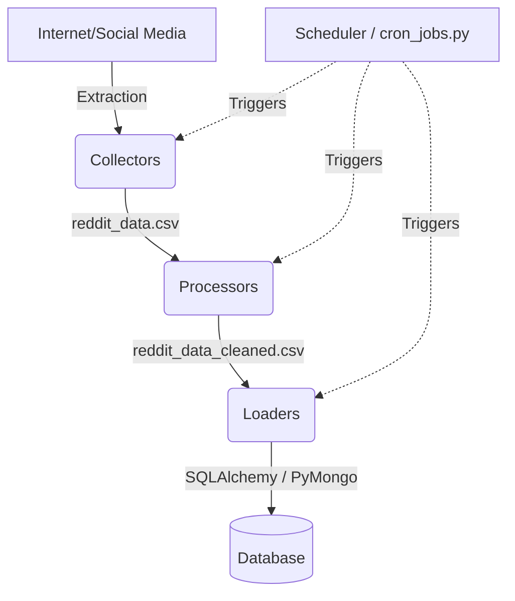

# Data Pipeline Documentation

This module manages the core Extract, Transform, Load (ETL) pipeline for the Trend Intelligence project. It is designed to run continuously in the background to automatically amass and harmonize data points for downstream machine-learning tasks.

## 🌊 How the Data Flows

The data follows a sequential flow through the sub-modules, orchestrated by the scheduler:

1. **Extraction (`collectors/`)**: Connects to external APIs (e.g., Reddit), downloads batches of posts and comments, and saves the raw but structured data locally into a CSV file.
2. **Transformation (`processors/`)**: Reads the raw CSV file and performs Natural Language Processing (NLP) text cleaning (removing URLs, emojis, and standardizing casing). Outputs a clean CSV file.
3. **Loading (`loaders/`)**: Reads the output CSVs and ingests them into the persistent database storage (PostgreSQL or MongoDB) for historical tracking and querying.
4. **Orchestration (`schedulers/`)**: The conductor that runs the above three steps in order on a continuous, automated loop.

---

## 🗄️ Data Storage Locations

Currently, the intermediate data files generated by the pipeline are saved locally as CSVs:

- **Raw Data (`reddit_data.csv`)**: 
  Saved inside the `data_pipeline/collectors/` directory. This contains the exact, unedited data downloaded by `reddit_collector.py`.
- **Clean Data (`reddit_data_cleaned.csv`)**: 
  Also saved inside the `data_pipeline/collectors/` directory. This is generated by `raw_to_clean.py` and contains the NLP-processed, sanitized text ready for ML or database upload.

---

## 📂 Module Breakdown & Functions

### 1. `config.py`
The global configuration file that stores all constants and secrets used across the pipeline.
- **What it does**: Holds base directory references, database credentials, specific URLs, Reddit keywords, subreddits to monitor, and scheduling delay intervals.

### 2. `collectors/`
Responsible for the "Extract" phase.
- **`reddit_collector.py`**: 
  - Iterates over predefined subreddits and keywords.
  - Queries the Reddit JSON API.
  - Formats text content and extracts nested comments.
  - Dynamically saves the aggregated list into `reddit_data.csv` in its own directory using absolute path resolution. 
- *Note: `news_collector.py` and `twitter_collector.py` are placeholders for future expansion.*

### 3. `processors/`
Responsible for the "Transform" phase.
- **`raw_to_clean.py`**:
  - Initializes `DataProcessor` which loads `reddit_data.csv`.
  - `.clean_text()` applies regex replacements to strip URLs, non-alphanumeric characters, and extra whitespaces.
  - Applies this cleanup uniformly over titles, post text, and chained comments.
  - Spits out a pristine `reddit_data_cleaned.csv` ready for database insertion or direct ML usage.

### 4. `loaders/`
Responsible for the "Load" phase.
- **`db_loader.py`**:
  - Exposes `DataLoader` to handle database connections logic using `sqlalchemy` and `pymongo`.
  - `.load_to_postgres()` reads CSV data into a Pandas DataFrame and pushes it to a relational PostgreSQL instance.
  - `.load_to_mongodb()` reads CSV data, converts it into JSON documents, and pushes it to a MongoDB collection.

### 5. `schedulers/`
Responsible for orchestrating operations continuously.
- **`cron_jobs.py`**:
  - Utilizes the Python `schedule` and `subprocess` libraries.
  - Exposes `.full_pipeline_job()` which kicks off the pipeline: `reddit_collector.py` -> `raw_to_clean.py` -> `db_loader.py`.
  - Designed to run indefinitely, waiting idly in the background, and checking every minute to see if a scheduled ETL snapshot is due.
